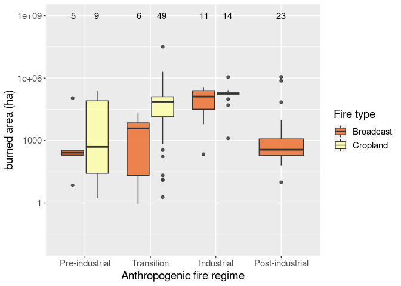
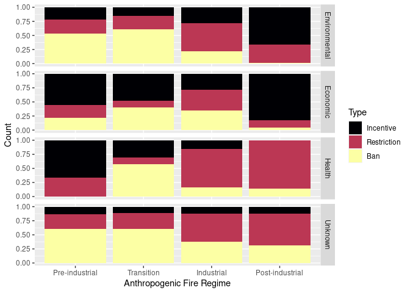

DAFI Paper
================
James Millington
2021-06-14

  - [Overview](#overview)
  - [3. Results](#results)
      - [3.1 Database Summary](#database-summary)
          - [Figure 1](#figure-1)
      - [Fire Purpose](#fire-purpose)
          - [Table 2](#table-2)
          - [Figure 2](#figure-2)
          - [Figure 3](#figure-3)
      - [3.3 Fire Suppression](#fire-suppression)
          - [Figure 4](#figure-4)
      - [3.4 Fire Policy](#fire-policy)
  - [4. Discussion](#discussion)
      - [4.1 Improving the quality of anthropogenic fire
        data](#improving-the-quality-of-anthropogenic-fire-data)
      - [4.2 Modelling and observing anthropogenic fire
        regimes](#modelling-and-observing-anthropogenic-fire-regimes)
          - [Figure 6](#figure-6)

# Overview

Analysis of DAFI Fire Use variables by Anthropogenic Fire Regime. Also
distinguishing Broadcast vs Cropland fires.

Load packages, data and supporting functions. Code not shown in rendered
document (i.e. html, pdf, etc) but can be viewed in original .rmd file.

``` r
source("manip-script.r", local = knitr::knit_global())
source("plots-script.r", local = knitr::knit_global())
```

# 3\. Results

## 3.1 Database Summary

``` r
ns <- n_distinct(record_info$`Study.ID`)
ncs <- n_distinct(record_info$`Case.Study.ID`)

pubs <- record_info %>%
  group_by(Study.Type) %>%
  summarise(n = n()) %>%
  mutate(perc = 100 * n / sum(n))
pubs
```

    ## # A tibble: 4 x 3
    ##   Study.Type     n   perc
    ##   <chr>      <int>  <dbl>
    ## 1 Academic    1707 94.4  
    ## 2 Government    48  2.65 
    ## 3 NGO           50  2.76 
    ## 4 Other          4  0.221

``` r
aca <- round(filter(pubs, Study.Type=='Academic')$perc,0)
govngo <- round(sum(filter(pubs, Study.Type=='NGO' | Study.Type=='Government')$perc),0)

datsrc <- record_info %>%
  mutate(Data.Source.s.=ifelse(grepl(',',Data.Source.s.), 'Mixed', as.character(Data.Source.s.))) %>%
  mutate(Data.Source.s.=ifelse(Data.Source.s.=='Review', 'Literature review', as.character(Data.Source.s.))) %>%
  group_by(Data.Source.s.) %>%
  summarise(n = n()) %>%
  mutate(perc = 100 * n / sum(n))


datsrc
```

    ## # A tibble: 6 x 3
    ##   Data.Source.s.        n  perc
    ##   <chr>             <int> <dbl>
    ## 1 Literature review   118  6.52
    ## 2 Mixed               432 23.9 
    ## 3 Other (see notes)    60  3.32
    ## 4 Primary             712 39.4 
    ## 5 Remote sensing       68  3.76
    ## 6 Secondary           419 23.2

``` r
src.fs <- round(filter(datsrc, Data.Source.s.=='Primary')$perc,0)
src.idr <- round(filter(datsrc, Data.Source.s.=='Secondary')$perc,0)
src.rs <- round(filter(datsrc, Data.Source.s.=='Remote sensing')$perc,0)
src.lr <- round(filter(datsrc, Data.Source.s.=='Literature review')$perc,0)
src.oth <- round(filter(datsrc, Data.Source.s.=='Other (see notes)')$perc,0)
src.mix <- round(filter(datsrc, Data.Source.s.=='Mixed')$perc,0)

#sum(datsrc$perc)
```

In this initial data collection, data from 504 studies were collated
from across 1809 human fire-related case studies.

Data were overwhelmingly from academic publications (94% of case
studies) but were also from reports produced by governments and NGOs
(5%).

Case studies used data exclusively from Field Studies (39% of case
studies), Institutional Data Repositories (23%), Literature Review (7%),
Remote Sensing (4%) or a combination (24%) of these data source types.
The remaining case studies (\~3%) used expert elicitation, media
reports, archival research and other reports as sources.

When these data sources are mapped spatially (Figure 1) we find a
prevalence of case studies using institutional data in Europe and North
America versus a dominance of field studies in Asia and Africa.

### Figure 1

``` r
srcmap <- map.behaviour.ras('Data.Source.s.', ras.function='mode')
srcmap
```

<!-- -->

``` r
afrmap <- map.behaviour.ras('Anthropogenic fire regime', ras.function='mode')
afrmap
```

<!-- -->

``` r
fumap <- map.behaviour.ras('Fire purpose', ras.function='mode')
fumap
```

<!-- -->

``` r
#number of case studies
ncs.rfire <- n_distinct(rep_fire_use$`Case Study ID`)

#count of incomplete case studies by variable
incsvar.rfire <- rep_fire_use %>%
  dplyr::select(-Notes, -Calculations) %>%
  group_by(`Case Study ID`) %>%
  summarise_each(funs(sum(is.na(.)))) %>%
  mutate_all(funs(ifelse(.>1,1,.))) %>%
  summarise_all(sum)
```

    ## Warning: funs() is soft deprecated as of dplyr 0.8.0
    ## Please use a list of either functions or lambdas: 
    ## 
    ##   # Simple named list: 
    ##   list(mean = mean, median = median)
    ## 
    ##   # Auto named with `tibble::lst()`: 
    ##   tibble::lst(mean, median)
    ## 
    ##   # Using lambdas
    ##   list(~ mean(., trim = .2), ~ median(., na.rm = TRUE))
    ## This warning is displayed once per session.

``` r
#count of missing values across all variables
mval.rfire <- incsvar.rfire %>%
  dplyr::select(-`Case Study ID`) %>%
  sum()

#total number of possible values
tval.rfire <- ncs.rfire * dim(incsvar.rfire)[2] - 1   #-1 to ignore the Case Study ID

#% missing values
tval.rfire.perc <- round(100* mval.rfire/ tval.rfire,0)


#count of incomplete case studies by variable for QUANTITATIVE vars only
incsvar.rfire.q <- rep_fire_use %>%
  dplyr::select_if(names(.)=="Case Study ID" | sapply(., is.numeric)) %>%
  dplyr::select(-`Study Year`) %>%
  group_by(`Case Study ID`) %>%
  summarise_each(funs(sum(is.na(.)))) %>%
  mutate_all(funs(ifelse(.>1,1,.))) %>%
  summarise_all(sum)

#count of missing values across all variables
mval.rfire.q <- incsvar.rfire.q %>%
  dplyr::select(-`Case Study ID`) %>%
  sum()

#total number of possible values
tval.rfire.q <- ncs.rfire * dim(incsvar.rfire.q)[2] - 1   #-1 to ignore the Case Study ID

#% missing values
tval.rfire.q.perc <- round(100* mval.rfire.q / tval.rfire.q,0)
```

Reflecting the fragmented nature of the anthropogenic fire literature,
no case study contained data on all variables and data across all DAFI
fields are sparse. For example, for reported fire use data, 60% of
values were missing, rising to 82% when only quantitative variables are
considered.

``` r
lu.AFR <- land_use %>% 
  rename(AFR = `Anthropogenic fire regime`) %>%
  count(AFR, .drop=FALSE) %>%
  drop_na()

cs.AFR <- sum(lu.AFR$n)

filter(lu.AFR, AFR=="Pre-industrial")$n
```

    ## [1] 261

Furthermore, we were able to define an AFR for only 1605 of the 1809
case studies (Pre-industrial 261, Transition 850, Industrial 300,
Post-industrial 194). The incompleteness of the database means that the
number of values used in analyses below varies depending on which
aspects of anthropogenic fire are being examined.

``` r
afrsrc <- merge(record_info, land_use, by.x= 'Case.Study.ID', by.y = 'Case Study ID')

afrsrc <- afrsrc %>% 
  mutate(Data.Source.s.=ifelse(grepl(',',Data.Source.s.), 'Mixed', as.character(Data.Source.s.))) %>%
  mutate(Data.Source.s.=ifelse(Data.Source.s.=='Review', 'Literature review', as.character(Data.Source.s.))) %>%
  dplyr::select(Data.Source.s., `Anthropogenic fire regime`)

table(afrsrc)
```

    ##                    Anthropogenic fire regime
    ## Data.Source.s.      Industrial Post-industrial Pre-industrial Transition
    ##   Literature review         46              41              6         20
    ##   Mixed                     63              37             44        278
    ##   Other (see notes)          3               1             17         36
    ##   Primary                   31              50            188        431
    ##   Remote sensing            20               7              6         30
    ##   Secondary                137              58              0         55

``` r
afrsrc.s <- summary(table(afrsrc))
afrsrc.p <- round(prop.table(table(afrsrc),2),2)
```

The spatial distribution of AFRs (Figure 1b) indicates a similar
distribution to data sources, with a prevalence of Industrial and
Post-Industrial regimes in Europe and North America versus a dominance
of Transition and Pre-Industrial regimes in Asia and Africa. A
Chi-square test for the association between AFR and data source
indicates non-randomness (Chi-sq = `round(afrsrc.s$statistic,0)`, df =
`afrsrc.s$parameter`, p \< 0.001) and Primary sources dominate case
studies of Pre-industrial (`100*max(afrsrc.p[,'Pre-industrial'])`% of
case studies) and Transition (`100*max(afrsrc.p[,'Transition'])`%)
regimes, whereas Secondary sources are the most frequent data sources
for case studies of Industrial (`100*max(afrsrc.p[,'Industrial'])`%) and
Post-industrial (`100*max(afrsrc.p[,'Post-industrial'])`%) regimes.

## Fire Purpose

``` r
rep_FUS <- rep_fire_use
est_FUS <- est_fire_use

rep_FUS$`Fire purpose` <- Simplify.purpose(rep_fire_use$`Fire purpose`, AFT = rep_fire_use$AFT)
est_FUS$`Fire purpose` <- Simplify.purpose(est_fire_use$`Fire purpose`, AFT = est_fire_use$AFT)

#summarise grouped (sum) by case study, AFR and fire use
fs.cs.afr <- plyr::rbind.fill(lapply(colnames(rep_fire_use)[c(13:20)],
                                     function (x){summarise.behaviour(temp.rep_fire_use=rep_FUS,temp.est_fire_use=est_FUS,
                                                                      type = "Fire", behaviour = x,
                                                                      #sum_multi = c('Case Study ID', 'Anthropogenic fire regime','Fire purpose','Study Year'),
                                                                      grouping = c('Case Study ID', 'Anthropogenic fire regime','Fire purpose'),
                                                                      inc.Absence = F, escape.rm = T)}))

#summarise grouped (sum) by case study, AFR and fire use
ba.cs.afr <- plyr::rbind.fill(lapply(colnames(rep_fire_use)[c(21:26)],
                                     function (x){summarise.behaviour(temp.rep_fire_use=rep_FUS,temp.est_fire_use=rep_FUS,
                                                                      type = "Fire", behaviour = x,
                                                                      #sum_multi = c('Case Study ID', 'Anthropogenic fire regime','Fire purpose'),
                                                                      grouping = c('Case Study ID', 'Anthropogenic fire regime','Fire purpose'),
                                                                      inc.Absence = F, escape.rm = T)}))

#summarise grouped (sum) by case study, AFR and fire use
rp.cs.afr <- plyr::rbind.fill(lapply(colnames(rep_fire_use)[27],
                                     function (x){summarise.behaviour(temp.rep_fire_use=rep_FUS,temp.est_fire_use=rep_FUS,
                                                                      type = "Fire", behaviour = x,
                                                                      #sum_multi = c('Case Study ID', 'Anthropogenic fire regime','Fire purpose'),
                                                                      grouping = c('Case Study ID', 'Anthropogenic fire regime','Fire purpose'),
                                                                      inc.Absence = F, escape.rm = T)}))
```

``` r
#DAFI Records %
fu.count <- rep_FUS %>%
  drop_na(`Fire purpose`) %>%
  tally()

fu.perc <- rep_FUS %>%
  drop_na(`Fire purpose`) %>%
  group_by(`Fire purpose`) %>%
  summarise(n=n()) %>%
  mutate(fuperc = 100* n / as.numeric(fu.count))

#% that the seven main fire use tyoe compose
fu.contrib <- round(sum(fu.perc$fuperc) - fu.perc$fuperc[fu.perc$`Fire purpose` == 'Other'],0)
```

Overall, 20 anthropogenic fire uses were identified during literature
review, but many were closely related (e.g., ‘pasture renewal’ and
‘rangeland management’). After such similar types were combined (see
Appendix C), seven dominant fire uses emerged (Table 2) each with more
than 100 instances in the database and accounting for 93% of fire
instance records.

### Table 2

#### DAFI records

``` r
fu.perc
```

    ## # A tibble: 8 x 3
    ##   `Fire purpose`             n fuperc
    ##   <chr>                  <int>  <dbl>
    ## 1 Arson                    118   3.48
    ## 2 Crop field preparation   700  20.6 
    ## 3 Crop residue burning     590  17.4 
    ## 4 Hunter gatherer          226   6.66
    ## 5 Other                    223   6.57
    ## 6 Pasture management       434  12.8 
    ## 7 Pyrome management        628  18.5 
    ## 8 Vegetation clearance     474  14.0

#### Mean size (ha)

``` r
#Mean Size (ha)  #intended fire size mean
fs.fp <- plyr::rbind.fill(lapply(colnames(rep_fire_use)[17],
                                     function (x){summarise.behaviour(temp.rep_fire_use=rep_FUS,temp.est_fire_use=est_FUS,
                                                                      type = "Fire", behaviour = x,
                                                                      grouping = c('Fire purpose'),
                                                                      inc.Absence = F, escape.rm = T)}))
fu.sizemn <- fs.fp %>%
  dplyr::select(`Fire purpose`, `Combined.stat`)

fu.sizemn 
```

    ##             Fire purpose Combined.stat
    ## 1                  Arson     3.6000000
    ## 2 Crop field preparation     0.7899407
    ## 3   Crop residue burning     3.9358281
    ## 4        Hunter gatherer     2.1251000
    ## 5                  Other     1.3344167
    ## 6     Pasture management    33.9394000
    ## 7      Pyrome management   357.2023810
    ## 8   Vegetation clearance     9.1709286
    ## 9                   <NA>    24.4153846

#### Mean burned area (% LS)

``` r
ba.fp        <- plyr::rbind.fill(lapply(colnames(rep_FUS)[c(23:27)], 
                                            function (x){summarise.behaviour(temp.rep_fire_use=rep_FUS,temp.est_fire_use=est_FUS,
                                                                             type = "Fire", sum_multi = FALSE,
                                               behaviour = x, grouping = c('Fire purpose'), escape.rm = T)}))
ba.fp$Intended <- ifelse(grepl('intended', tolower(ba.fp$Behaviour)), 'Intended', 'Actual')

ba.fp.i <- ba.fp %>%
  filter(grepl('land cover', Behaviour)) %>%
  filter(Intended == 'Intended') %>%
  rbind(c('Hunter gatherer',rep(0,6),'Intended burned area % (land cover)','Intended')) %>%
  mutate(Combined.stat = as.numeric(Combined.stat), 
         Combined.N = as.numeric(Combined.N)) %>%
  arrange(`Fire purpose`)
  
ba.fp.a <- ba.fp %>%
  filter(grepl('land cover', Behaviour)) %>%
  filter(Intended == 'Actual') %>%
  mutate(Combined.stat = as.numeric(Combined.stat), 
         Combined.N = as.numeric(Combined.N)) %>%
  drop_na(`Fire purpose`) %>%
  arrange(`Fire purpose`)

ba.fp.lc <- round(((ba.fp.i$Combined.stat * ba.fp.i$Combined.N) + (ba.fp.a$Combined.stat * ba.fp.a$Combined.N)) / (ba.fp.i$Combined.N + ba.fp.a$Combined.N),1)

ba.fp.lc <- cbind.data.frame(ba.fp.i$`Fire purpose`, ba.fp.lc)

ba.fp.lc
```

    ##   ba.fp.i$`Fire purpose` ba.fp.lc
    ## 1 Crop field preparation     12.8
    ## 2   Crop residue burning     22.8
    ## 3        Hunter gatherer      9.1
    ## 4     Pasture management     32.1
    ## 5      Pyrome management      8.9
    ## 6   Vegetation clearance      6.6

#### Return period (years)

``` r
rp.fp <- plyr::rbind.fill(lapply(colnames(rep_FUS)[27],
                                     function (x){summarise.behaviour(temp.rep_fire_use=rep_FUS,temp.est_fire_use=est_FUS,
                                                                      type = "Fire", behaviour = x,
                                                                      sum_multi = F,
                                                                      grouping = c('Fire purpose'),
                                                                      inc.Absence = F, escape.rm = T)}))
dplyr::select(rp.fp, `Fire purpose`, Combined.stat) 
```

    ##             Fire purpose Combined.stat
    ## 1                  Arson      3.000000
    ## 2 Crop field preparation      9.797941
    ## 3   Crop residue burning      1.481539
    ## 4        Hunter gatherer      4.329545
    ## 5                  Other      3.260000
    ## 6     Pasture management      3.046744
    ## 7      Pyrome management      5.680000
    ## 8                   <NA>      5.376667

#### Escaped %

For fires uses with complete data

``` r
igs <-  plyr::rbind.fill(lapply(colnames(rep_FUS)[c(11:12)],
                                  function (x){summarise.behaviour(temp.rep_fire_use=rep_FUS,temp.est_fire_use=est_FUS,
                                                                   type = "Fire", sum_multi =  FALSE,
                                                                   behaviour = x, grouping = c('Fire type', 'Fire purpose'), 
                                                                   inc.Absence = F, escape.rm = F)}))

igs.e <- igs %>% 
  filter(`Fire type` == 'Human, escaped' & !is.na(`Fire purpose`) & grepl('land cover',Behaviour)) %>%
  filter(`Fire purpose` != 'Hunter gatherer') %>%
  mutate(Combined.stat = as.numeric(Combined.stat), 
         Combined.N = as.numeric(Combined.N)) %>%
  arrange(`Fire purpose`)

igs.d <- igs %>% 
  filter(`Fire type` == 'Human, deliberate' & !is.na(`Fire purpose`) & grepl('land cover',Behaviour)) %>%
  filter(!(`Fire purpose` %in% c('Arson','Pyrome management','Vegetation clearance'))) %>%
  mutate(Combined.stat = as.numeric(Combined.stat), 
         Combined.N = as.numeric(Combined.N)) %>%
  arrange(`Fire purpose`) 

esc.n <- rep_FUS %>% 
  filter(`Fire type` == 'Human, escaped'  & !is.na(`Fire purpose`)) %>%
  group_by_at(.vars = c('Fire purpose', 'Fire type')) %>%
  summarise(count = n()) %>%
  filter(`Fire purpose` %in% c('Crop field preparation', 'Crop residue burning', 'Pasture management')) %>%
  arrange(`Fire purpose`)

del.n <-  rep_FUS %>% 
  filter(`Fire type` == 'Human, deliberate'  & !is.na(`Fire purpose`)) %>%
  group_by_at(.vars = c('Fire purpose', 'Fire type')) %>%
  summarise(count = n()) %>%
  filter(`Fire purpose` %in% c('Crop field preparation', 'Crop residue burning', 'Pasture management')) %>%
  arrange(`Fire purpose`)

escaped <- 
round(100*(esc.n$count / (esc.n$count + del.n$count)) * (igs.e$Combined.stat / (igs.e$Combined.stat + igs.d$Combined.stat)),2)

escaped <- cbind.data.frame(del.n$`Fire purpose`, escaped)
escaped
```

    ##     del.n$`Fire purpose` escaped
    ## 1 Crop field preparation    0.06
    ## 2   Crop residue burning    0.01
    ## 3     Pasture management    5.01

For less complete fire uses, use global (non-cropland) means with
overall counts

``` r
igs.o <-  plyr::rbind.fill(lapply(colnames(rep_FUS)[c(11:12)],
                                  function (x){summarise.behaviour(temp.rep_fire_use=rep_FUS,temp.est_fire_use=est_FUS,
                                                                   type = "Fire", 
                                  sum_multi =  FALSE,
                                   behaviour = x, grouping = c('Fire type', 'Fire purpose'), escape.rm = F)}))

igs.o.d <- igs.o %>% filter(`Fire type` == 'Human, deliberate' & !is.na(`Fire purpose`)) %>%
  filter(grepl('total', Behaviour)) %>%
  filter(!(`Fire purpose` %in% c('Crop field preparation', 'Crop residue burning'))) %>%
  filter(`Fire purpose` != 'Other')

denom <- sum(igs.o.d$Combined.stat*igs.o.d$Combined.N) / sum(igs.o.d$Combined.N)


igs.o.e <- igs.o %>% filter(`Fire type` == 'Human, escaped' & !is.na(`Fire purpose`)) %>%
  filter(!(`Fire purpose` %in% c('Crop field preparation', 'Crop residue burning'))) %>%
  filter(grepl('total', Behaviour)) %>%
  filter(`Fire purpose` != 'Other')

numer <-sum(igs.o.e$Combined.stat*sum(igs.o.e$Combined.N)) / sum(igs.o.e$Combined.N)

esc.n.g <- rep_FUS%>% 
  filter(`Fire type` == 'Human, escaped'  & !is.na(`Fire purpose`)) %>%
  group_by_at(.vars = c('Fire purpose', 'Fire type')) %>%
  filter(!(`Fire purpose` %in% c('Crop field preparation', 'Crop residue burning', 'Pasture management', 'Other', 'Arson'))) %>%
  summarise(count = n())

del.n.g <- rep_FUS%>% 
  filter(`Fire type` == 'Human, deliberate'  & !is.na(`Fire purpose`)) %>%
  group_by_at(.vars = c('Fire purpose', 'Fire type')) %>%
  filter(!(`Fire purpose` %in% c('Crop field preparation', 'Crop residue burning', 'Pasture management', 'Other', 'Arson'))) %>%
  summarise(count = n())

escaped.g <- 
round(100*(esc.n.g$count / (esc.n.g$count + del.n.g$count)) * (numer / denom),2)

escaped.g <- cbind.data.frame(del.n.g$`Fire purpose`, escaped.g)
escaped.g
```

    ##   del.n.g$`Fire purpose` escaped.g
    ## 1        Hunter gatherer      1.10
    ## 2      Pyrome management      0.06
    ## 3   Vegetation clearance      0.95

### Figure 2

``` r
a <- filter(rep_fire_use, `Presence / Absence` == 'Presence')
b <- filter(est_fire_use, `Presence / Absence` == 'Presence')

fig2 <- bar.purpose.regime(a, b, bartype='fill')
ggsave('/home/james/OneDrive/Research/Papers/InProgress/Perkins_DAFI/figures/Figure2.png', plot=fig2, height=12, width=14, units='cm', dpi=300)
bar.purpose.regime(rep_fire_use, est_fire_use, bartype='dodge')
```

<!-- -->

``` r
fig2
```

<!-- -->

``` r
fig2all <- bar.purpose.regime(rep_fire_use, est_fire_use, bartype='fill')
fig2all
```

<!-- -->

#### Ignitions

``` r
igs <- plyr::rbind.fill(lapply(colnames(rep_FUS)[c(11:12)],
                      function (x){summarise.behaviour(temp.rep_fire_use=rep_FUS,temp.est_fire_use=est_FUS,
                                                       type = "Fire", behaviour = x, 
                                                       grouping = c('Case Study ID'), escape.rm = T)}))


igs.med <- round(median(igs$Combined.stat),2)
igs.mean <- round(sum(igs$Combined.stat * igs$Combined.N) / sum(igs$Combined.N, na.rm = T),2)
```

Data in DAFI show that deliberate anthropogenic fires occur (where
present) at a median and mean rate of 0.08 and `igs.mean` km-2 year-1
respectively.

#### Return Interval

``` r
### Fire Return Period - not annualised
FR <- plyr::rbind.fill(lapply(colnames(rep_FUS)[c(27)], 
                               function (x){summarise.behaviour(temp.rep_fire_use=rep_FUS,temp.est_fire_use=est_FUS,
                                                                type = "Fire", behaviour = x, 
                                                                grouping = c('Case Study ID'), escape.rm = T)}))
ri.mean <- round(sum(FR$Combined.stat * FR$Combined.N) / sum(FR$Combined.N, na.rm = T),2)

### median FR - use all values for more accuracy (not possible for igs using aggregation)
all_fire <- rep_FUS
all_fire$`Fire return period (years)` <- ifelse(is.na(all_fire$`Fire return period (years)`), 
                                                unlist(unbin(est_FUS$`Fire return period (years)`)), 
                                                all_fire$`Fire return period (years)`)

all_fire <- all_fire %>% filter(`Fire type` == 'Human, deliberate' & `Presence / Absence` == 'Presence')

ri.med <- round(median(all_fire$`Fire return period (years)`, na.rm = T),2)
```

Similarly, fire return intervals are typically short, with median of 3
and mean of 6.37 years.

### Figure 3

``` r
fs_mean_kde <- hist.fire.regime(dat.temp=fs.cs.afr,metric = 'fire size mean', bin_width = -1, actual = F, log_scale=T, regime=F, vertical=T, scale_limits = c(0.1, 10000)) 
#ggsave('/home/james/OneDrive/Research/Papers/InProgress/Perkins_DAFI/figures/fs_mean_kde.pdf', plot=fs_mean_kde, height=14, width=9, units='cm')
fs_mean_kde
```

    ## Warning: Removed 4 rows containing non-finite values (stat_density).

<!-- -->

``` r
fs_mean_box <- box.FS.regime(fs.cs.afr, metric = 'mean', boxtype='box', 
                   estimated = T, reported = T, log_scale = T, cropland = T, scale_limits = c(0.1, 10000))
#ggsave('/home/james/OneDrive/Research/Papers/InProgress/Perkins_DAFI/figures/fs_mean_box.pdf', plot=fs_mean_box, height=14, width=16, units='cm')
fs_mean_box 
```

    ## Warning: Removed 11 rows containing non-finite values (stat_boxplot).

    ## Warning: Removed 11 rows containing non-finite values (stat_summary).

<!-- -->

``` r
ba_ha_box <- box.BA.regime(dat.temp=ba.cs.afr,metric = 'burned area (ha)', boxtype='box', 
              log_scale = T, cropland = T, scale_limits = c(0.01, 1000000000)) 
#ggsave('/home/james/OneDrive/Research/Papers/InProgress/Perkins_DAFI/figures/ba_ha_box.pdf', plot=ba_ha_box, height=14, width=16, units='cm')
ba_ha_box
```

<!-- -->

``` r
ba_ha_kde <- hist.fire.regime(dat.temp=ba.cs.afr,metric = 'burned area (ha)', bin_width = -1, log_scale=T, regime=F, vertical=T,  scale_limits = c(0.01, 1000000000)) 
#ggsave('/home/james/OneDrive/Research/Papers/InProgress/Perkins_DAFI/figures/ba_ha_kde.pdf', plot=ba_ha_kde, height=14, width=9, units='cm')
ba_ha_kde
```

<!-- -->

## 3.3 Fire Suppression

### Figure 4

``` r
#suppression at case study level
#
#only count CaseStudy once for each AFR-Suppression-Effort combination
#don't use pivot_longer as that results in double-counting

cleanEffort <- function(supTbl, supLabel){
  
  rsupTbl <- supTbl %>%
    setNames(c("Case","AFR","Effort")) %>%
    drop_na() %>%
    filter(Effort != 'ND') %>%
    mutate(Effort = recode(Effort, `0`='None',`1`='Limited',`2`='Moderate',`3`='Intensive')) %>%
    group_by_all %>%
    summarise(n= n()) %>%
    dplyr::select(-n) %>%
    mutate(Suppression = supLabel)
  
  return(rsupTbl)
  
}

sup.c <- cleanEffort(dplyr::select(suppression, 1,2,9),'Control')
sup.p <- cleanEffort(dplyr::select(suppression, 1,2,11),'Prevention')
sup.e <- cleanEffort(dplyr::select(suppression, 1,2,13),'Extinction')

c.sup <- rbind(sup.c, sup.p, sup.e)  

c.sup.c <- c.sup %>% 
  ungroup() %>%
  mutate(Effort = factor(Effort, levels = c("None","Limited","Moderate","Intensive"))) %>%
  mutate(AFR = factor(AFR, levels = c("Pre-industrial","Transition","Industrial","Post-industrial"))) %>% 
  mutate(Suppression = factor(Suppression,levels = c("Control","Prevention","Extinction"))) %>%
  count(AFR, Suppression, Effort,.drop=FALSE)


#paper figure!
p3 <- c.sup.c %>%
  ggplot(aes(x = AFR, y=n)) +
  geom_bar(aes(fill=Effort),position='dodge',stat="identity") +
  facet_grid(Suppression~.) +
  scale_fill_viridis_d(option = 'inferno') +
  xlab("Anthropogenic Fire Regime") +
  ylab("Count")


p4 <- c.sup.c %>%
  ggplot(aes(x = AFR, y=n)) +
  geom_bar(aes(fill=Effort),position='fill',stat="identity") +
  facet_grid(Suppression~.) +
  scale_fill_viridis_d(option = 'inferno') +
  xlab("Anthropogenic Fire Regime") +
  ylab("Count")

p3
```

<!-- -->

``` r
p4
```

<!-- -->

``` r
c.sup.c %>%
 filter(Effort != "None") %>%
 group_by(AFR, Suppression) %>%
 summarise(sum = sum(n))
```

    ## # A tibble: 12 x 3
    ## # Groups:   AFR [4]
    ##    AFR             Suppression   sum
    ##    <fct>           <fct>       <int>
    ##  1 Pre-industrial  Control        44
    ##  2 Pre-industrial  Prevention     31
    ##  3 Pre-industrial  Extinction      8
    ##  4 Transition      Control        69
    ##  5 Transition      Prevention     91
    ##  6 Transition      Extinction     72
    ##  7 Industrial      Control        32
    ##  8 Industrial      Prevention    129
    ##  9 Industrial      Extinction     63
    ## 10 Post-industrial Control        58
    ## 11 Post-industrial Prevention    104
    ## 12 Post-industrial Extinction     45

``` r
c.sup.c %>%
 group_by(AFR, Effort) %>%
 summarise(sum = sum(n))
```

    ## # A tibble: 16 x 3
    ## # Groups:   AFR [4]
    ##    AFR             Effort      sum
    ##    <fct>           <fct>     <int>
    ##  1 Pre-industrial  None         12
    ##  2 Pre-industrial  Limited      23
    ##  3 Pre-industrial  Moderate     57
    ##  4 Pre-industrial  Intensive     3
    ##  5 Transition      None         80
    ##  6 Transition      Limited     104
    ##  7 Transition      Moderate    106
    ##  8 Transition      Intensive    22
    ##  9 Industrial      None         50
    ## 10 Industrial      Limited      60
    ## 11 Industrial      Moderate     85
    ## 12 Industrial      Intensive    79
    ## 13 Post-industrial None         90
    ## 14 Post-industrial Limited      32
    ## 15 Post-industrial Moderate    101
    ## 16 Post-industrial Intensive    74

``` r
filter(c.sup, AFR=='Post-industrial', Effort=="Intensive", Suppression=="Extinction")
```

    ## # A tibble: 42 x 4
    ## # Groups:   Case, AFR [42]
    ##    Case  AFR             Effort    Suppression
    ##    <chr> <chr>           <fct>     <chr>      
    ##  1 170b  Post-industrial Intensive Extinction 
    ##  2 170c  Post-industrial Intensive Extinction 
    ##  3 170d  Post-industrial Intensive Extinction 
    ##  4 170e  Post-industrial Intensive Extinction 
    ##  5 170f  Post-industrial Intensive Extinction 
    ##  6 170g  Post-industrial Intensive Extinction 
    ##  7 170h  Post-industrial Intensive Extinction 
    ##  8 170i  Post-industrial Intensive Extinction 
    ##  9 170j  Post-industrial Intensive Extinction 
    ## 10 170k  Post-industrial Intensive Extinction 
    ## # … with 32 more rows

## 3.4 Fire Policy

``` r
#figure not included but code retained
pol.sum <- plyr::rbind.fill(lapply(colnames(policy)[c(10,14,19)],
                                     function (x){summarise.behaviour(type = "Policy", behaviour = x,
                                                                      grouping = c('Anthropogenic fire regime','Direct Fire policy ID'),
                                                                      inc.Absence = F, escape.rm = T)}))
pol.sum <-pol.sum[!is.na(pol.sum$`Anthropogenic fire regime`),]
pol.sum <- pol.sum %>% 
    count(`Anthropogenic fire regime`, Behaviour,.drop=FALSE)

pol.sum$`Anthropogenic fire regime` <- factor(pol.sum$`Anthropogenic fire regime`, levels = c("Pre-industrial","Transition","Industrial","Post-industrial"))

p7 <- pol.sum %>%
  ggplot(aes(x = `Anthropogenic fire regime`, y=n)) +
  geom_bar(aes(fill=Behaviour),position='dodge',stat="identity") +
  scale_fill_viridis_d(option = 'inferno') +
  xlab("Anthropogenic Fire Regime") +
  ylab("Count")
```

``` r
#policy at case study level 
pol.cs <- policy %>%
  dplyr::select(1,2,4,10:17,19:22) %>%
  rename('Case'=1,'AFR' = 2) %>%
  #rename('Health restriction' = 'Human health restriction') %>%
  #rename('Health ban' = 'Human health ban') %>%
  #filter(`Fire type` == 'Human, deliberate') %>% 
  mutate_at(vars(-1,-2,-3), funs(case_when(grepl("Yes", ., ignore.case=TRUE) ~ "Yes"))) %>%
  dplyr::select(-`Fire type`)

#create 'Other' Rationale for when Type = Yes but individual rationale is not specified
pol.cs <- pol.cs %>% 
  rename('Unknown incentives' = 'Incentives') %>%
  rename('Unknown restriction' = 'Fire restricted') %>%
  rename('Unknown ban' = 'Fire banned') %>%
  mutate(`Unknown incentives` = if_else(`Unknown incentives` == "Yes" & is.na(`Economic incentives`) &
                                          is.na(`Environmental incentives`) & is.na(`Health incentives`), "Yes", NA_character_)) %>%
  mutate(`Unknown restriction` = if_else(`Unknown restriction` == "Yes" & is.na(`Economic restriction`) &
                                          is.na(`Environmental restriction`) & is.na(`Health restriction`), "Yes", NA_character_)) %>%
  mutate(`Unknown ban` = if_else(`Unknown ban` == "Yes" & is.na(`Economic ban`) &
                                          is.na(`Environmental ban`) & is.na(`Health ban`), "Yes", NA_character_))

pol.cs <- pol.cs %>%
  group_by_all %>%
  summarise(n= n()) %>%
  ungroup()

#go long
pol.cs <-pivot_longer(pol.cs, cols=c(`Unknown incentives`:`Health ban`), names_to="Rationale-Type")

#create new columns for Rationale and Type then set factors and levels
pol.cs <- pol.cs %>%
  separate(`Rationale-Type`, c("Rationale", "Type"), sep=" ") %>%
  mutate(Type = recode_factor(Type, incentives='Incentive',restriction='Restriction',ban='Ban')) %>%
  mutate(Rationale = factor(Rationale, levels=c("Environmental","Economic","Health","Unknown"))) %>%
  mutate(AFR = factor(AFR, levels = c("Pre-industrial","Transition","Industrial","Post-industrial")))

#drop NAs and count         
pol.cs <- pol.cs %>% 
  drop_na(value) %>%
  drop_na(AFR) %>%
  count(AFR, Type, Rationale,.drop=FALSE)

#plot
p.pol.cs <- pol.cs %>%
  ggplot(aes(x = AFR, y=n)) +
  geom_bar(aes(fill=Type),position='dodge',stat="identity") +
  facet_grid(Rationale~.) +
  scale_fill_viridis_d(option = 'inferno') +
  xlab("Anthropogenic Fire Regime") +
  ylab("Count")

#plot stacked
s.pol.cs <- pol.cs %>%
  ggplot(aes(x = AFR, y=n)) +
  geom_bar(aes(fill=Type),position='fill',stat="identity") +
  facet_grid(Rationale~.) +
  scale_fill_viridis_d(option = 'inferno') +
  xlab("Anthropogenic Fire Regime") +
  ylab("Count")

p.pol.cs
```

<!-- -->

``` r
s.pol.cs
```

<!-- -->

``` r
pol.cs %>%
  group_by(Type) %>%
  summarise(sum = sum(n))
```

    ## # A tibble: 3 x 2
    ##   Type          sum
    ##   <fct>       <int>
    ## 1 Incentive     273
    ## 2 Restriction   219
    ## 3 Ban           355

# 4\. Discussion

## 4.1 Improving the quality of anthropogenic fire data

``` r
ba.rep <- ba.cs.afr %>%
      drop_na(`Anthropogenic fire regime`) %>%
      filter(Combined.stat > 0.01) %>%
      filter(grepl('burned area (ha)',Behaviour,fixed=TRUE)) 

fs.rep  <- fs.cs.afr %>%
      drop_na(`Anthropogenic fire regime`) %>%
      filter(Combined.stat > 0.01) %>%
      filter(grepl('mean',Behaviour,fixed=TRUE))

ba.rep <- round(100 * length(ba.rep[,1]) / n_distinct(record_info$`Case.Study.ID`),1)
fs.rep <- round(100 * length(fs.rep[,1]) / n_distinct(record_info$`Case.Study.ID`),1)
```

we find that in case studies, burned area metrics are reported less
frequently than fire size metrics (6.5% of case studies vs 17.1%).

## 4.2 Modelling and observing anthropogenic fire regimes

### Figure 6

``` r
#https://datascience.blog.wzb.eu/2019/04/30/zooming-in-on-maps-with-sf-and-ggplot2/
##https://ggplot2.tidyverse.org/reference/ggsf.html
library(sf)
```

    ## Linking to GEOS 3.7.1, GDAL 2.4.2, PROJ 5.2.0

``` r
library(rnaturalearth)
library(rnaturalearthdata)
worldmap <- ne_countries(scale = 'medium', type = 'map_units',returnclass = 'sf')


dat <- right_join(record_info, est_fire_use, by=c("Case.Study.ID"='Case Study ID'))

dat$Latitude <- as.numeric(dat$Latitude)
```

    ## Warning: NAs introduced by coercion

``` r
dat$Longitude<- as.numeric(dat$Longitude) 
```

    ## Warning: NAs introduced by coercion

``` r
fsdat <- dat %>% 
  filter(grepl('Crop',`Fire purpose`)) %>%
  drop_na(`Fire season start`) %>%
  mutate(`Fire season start` = factor(`Fire season start`, levels = month.name)) %>%
  mutate(`Fire quarter` = factor(case_when(
    `Fire season start` == 'December' | `Fire season start` == 'January' | `Fire season start` == 'February' ~ 'DJF',
    `Fire season start` == 'March' | `Fire season start` == 'April' | `Fire season start` == 'May' ~ 'MAM',
    `Fire season start` == 'June' | `Fire season start` == 'July' | `Fire season start` == 'August' ~ 'JJA',
    `Fire season start` == 'September' | `Fire season start` == 'October' | `Fire season start` == 'November' ~ 'SON'), 
    levels= c('DJF','MAM','JJA','SON')))

shapes = c(21,23) 
inset_x <- c(70, 95)
inset_y <- c(20, 33)

#hack described here: https://github.com/tidyverse/ggplot2/issues/3909#issuecomment-602253881
myrect <- 
  list(
    cbind(
      c(inset_x[1], inset_x[2], inset_x[2], inset_x[1], inset_x[1]), 
      c(inset_y[1], inset_y[1], inset_y[2], inset_y[2], inset_y[1])
    )
  ) %>%
  st_polygon() %>%
  st_sfc(crs = "+proj=longlat +ellps=WGS84 +datum=WGS84 +no_defs")

w <- ggplot() +
  geom_sf(data = worldmap, fill="beige", colour='grey',size=0.1) +
  geom_sf(data = myrect,
  #geom_rect(xmin = 50, xmax = 70, ymin = 50, ymax = 70, 
     fill = NA, colour = "red", size = 0.5) +
  coord_sf(xlim = c(-170, 181), ylim = c(-60, 85), expand = FALSE) +
  geom_point(data=fsdat,aes(x = Longitude, y = Latitude, shape = `Fire purpose`, fill= `Fire quarter`),
             colour='black', size = 0.75, stroke=0.1, alpha=0.9) + 
  theme(
    panel.background = element_rect(fill = "azure",colour = "black",size = 0.5, linetype = "solid"),
    panel.grid.major = element_line(linetype='blank'),
    panel.grid.minor = element_line(linetype='blank'),
    legend.key = element_rect(fill = "white", colour = "white")
  ) +
  scale_fill_viridis_d(option='inferno') + 
  guides(fill=guide_legend(override.aes=list(shape=22))) +
  scale_shape_manual(values=shapes) 


i <- ggplot() + 
  geom_sf(data = worldmap, fill='beige', colour='grey') + 
  coord_sf(xlim = inset_x, ylim = inset_y, expand = FALSE) +
  geom_point(data=fsdat, aes(x = Longitude, y = Latitude, shape = `Fire purpose`, fill= `Fire quarter`),
             colour='black', size = 2, stroke=0.5, alpha=0.9) +
    theme(
    panel.background = element_rect(fill = "azure",colour = "red",size = 0.5, linetype = "solid"),
    panel.grid.major = element_line(linetype='blank'),
    panel.grid.minor = element_line(linetype='blank'),
    legend.key = element_rect(fill = "white", colour = "white")
  ) +
  scale_fill_viridis_d(option='inferno') + 
  guides(fill=guide_legend(override.aes=list(shape=22))) +
  scale_shape_manual(values=shapes) 
```

``` r
w
```

    ## Warning: Removed 1 rows containing missing values (geom_point).

<!-- -->

``` r
i
```

    ## Warning: Removed 1 rows containing missing values (geom_point).

<!-- -->

``` r
count21ha <- rep_FUS %>%
  filter(`Actual fire size mean (ha)` > 21) %>%
  filter(`Presence / Absence` == 'Presence') %>%
  filter(`Fire type` == 'Human, deliberate') %>%
  nrow(.)
  
count0ha <- rep_FUS %>%
  filter(`Actual fire size mean (ha)` > 0) %>%
  filter(`Presence / Absence` == 'Presence') %>%
  filter(`Fire type` == 'Human, deliberate') %>%
  nrow(.)  

perc21 <- 100 - (100 * as.numeric(count21ha) / as.numeric(count0ha))

count100ha <- rep_FUS %>%
  filter(`Actual fire size mean (ha)` > 100) %>%
  filter(`Presence / Absence` == 'Presence') %>%
  filter(`Fire type` == 'Human, deliberate') %>%
  nrow(.)
  
perc100 <- 100 - (100 * as.numeric(count100ha) / as.numeric(count0ha))
```

We find that 59.5744681% of records in DAFI for mean size of
deliberately started fires are \<21 ha, suggesting many anthropogenic
fires will not be detected.

Ramo et al. (2021) also found that fires \<100 ha are critically
important for characterizing landscape fire on a global scale. Our
results from DAFI support this; 78.7234043% of mean fire size records
for deliberately started fires are \<100ha, and cropland fires in
pre-industrial and transition regimes are generally smaller compared to
fires ignited to burn across landscapes more broadly (Figure 3x\!).

Furthermore, the median and mean ignition density for deliberate
anthropogenic fires in DAFI (0.08 and `igs.mean` respectively, section
3.2.2) are far greater than the median value suggested by the
MODIS-derived global fire atlas (\< 0.01 fires km-2 year-1; Andela et
al., 2019).

``` r
rep_FUS <- rep_fire_use
rep_FUS$`Fire purpose` <- Simplify.purpose(rep_fire_use$`Fire purpose`, AFT = rep_fire_use$AFT)

hg.min <- rep_FUS %>%
  filter(`Fire purpose` == 'Hunter gatherer') %>%
  filter(`Presence / Absence` == 'Presence') %>%
  summarise(min=min(`Actual fire size min (ha)`, na.rm=T))
hg.min
```

    ##   min
    ## 1 0.5

``` r
hg.max <- rep_FUS %>%
  filter(`Fire purpose` == 'Hunter gatherer') %>%
  filter(`Presence / Absence` == 'Presence') %>%
  summarise(max=max(`Actual fire size max (ha)`, na.rm=T))
```

    ## Warning in max(`Actual fire size max (ha)`, na.rm = T): no non-missing arguments
    ## to max; returning -Inf

``` r
hg.max
```

    ##    max
    ## 1 -Inf

``` r
pas.min <- rep_FUS %>%
  filter(`Fire purpose` == 'Pasture management') %>%
  filter(`Presence / Absence` == 'Presence') %>%
  summarise(min=min(`Actual fire size min (ha)`, na.rm=T))
pas.min
```

    ##        min
    ## 1 0.404686

``` r
pas.max <- rep_FUS %>%
  filter(`Fire purpose` == 'Pasture management') %>%
  filter(`Presence / Absence` == 'Presence') %>%
  summarise(max=max(`Actual fire size max (ha)`, na.rm=T))
pas.max
```

    ##   max
    ## 1 150

``` r
fs.fp <- plyr::rbind.fill(lapply(colnames(rep_fire_use)[13:20],
                                     function (x){summarise.behaviour(temp.rep_fire_use=rep_FUS,temp.est_fire_use=est_FUS,
                                                                      type = "Fire", behaviour = x,
                                                                      grouping = c('Fire purpose'),
                                                                      inc.Absence = F, escape.rm = T)})) %>%
  filter(`Fire purpose` %in% c('Hunter gatherer', 'Pasture management')) %>%
  filter((grepl('max', Behaviour) | grepl('min', Behaviour)) & grepl('Actual', Behaviour))

hg.min <- filter(fs.fp, `Fire purpose` == 'Hunter gatherer' & grepl('min', Behaviour))$Combined.stat
hg.max <- filter(fs.fp, `Fire purpose` == 'Hunter gatherer' & grepl('max', Behaviour))$Combined.stat

pas.min <- filter(fs.fp, `Fire purpose` == 'Pasture management' & grepl('min', Behaviour))$Combined.stat
pas.max <- filter(fs.fp, `Fire purpose` == 'Pasture management' & grepl('max', Behaviour))$Combined.stat
```

In particular, hunter-gatherer fire sizes vary more than pasture
managament fires, with sizes ranging from 1.4 ha to 8345 ha compared to
4.4 ha to 244.8 ha.
